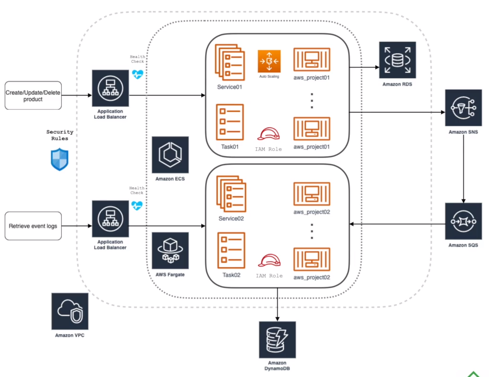

# curso_aws_cdk

## What does it do?
Basically creates resources on AWS via CLI...

## Responsibility
Provision resources on AWS via CDK in Java.

## Development

#### Pre-requisites:
* IntelliJ
* Java 17
* Docker
* If you want to use [Docker](https://docs.docker.com/), install version 1.12 or greater: https://docs.docker.com/get-docker/

#### Service architecture


#### Running

```bash
$ cdk deploy --parameters Rds:databasePassword=matilde123456 Rds Service01 Service02 Vpc Cluster Sns
```

### About
This is a blank project for Java development with CDK.

The `cdk.json` file tells the CDK Toolkit how to execute your app.

It is a [Maven](https://maven.apache.org/) based project, so you can open this project with any Maven compatible Java IDE to build and run tests.

## Useful commands

 * `mvn package`     compile and run tests
 * `cdk ls`          list all stacks in the app
 * `cdk synth`       emits the synthesized CloudFormation template
 * `cdk deploy`      deploy this stack to your default AWS account/region
 * `cdk diff`        compare deployed stack with current state
 * `cdk docs`        open CDK documentation
